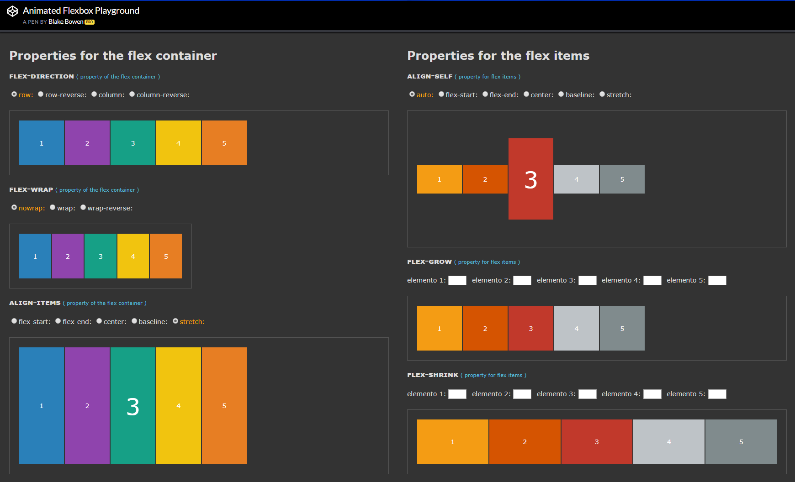
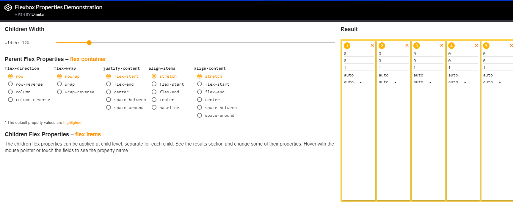

# mobile-knowledge
站在 web 前端开发学习移动客户端开发的角度整理相关急需补充的学习材料。

## 人机交互篇
* [Material-Design](https://www.material.io/design/)
* [Material-Design-Chinese](https://github.com/zdhxiong/Material-Design-Chinese)
* [Human Interface Guidelines](https://developer.apple.com/design/human-interface-guidelines/ios/overview/themes/)

## 设计与规范篇
* [PX/PT/PPI/DPI/DP/SP 之间的关系](https://www.ui.cn/detail/194953.html)
* [iOS icons 尺寸/命名规范](https://www.ui.cn/detail/31352.html)
* [UI 设计规范](https://www.ui.cn/detail/98829.html)
* [APP 设计规范和切图总结](https://www.ui.cn/detail/88828.html)
* [一款 APP，从设计稿到切图(Android 篇)](https://www.ui.cn/detail/79573.html)
* [一款 APP，从设计稿到切图(iOS 篇)](https://www.ui.cn/detail/67329.html)

## flex 布局篇
* [Flex 布局教程：语法篇](http://www.ruanyifeng.com/blog/2015/07/flex-grammar.html)
* [Flex 布局教程：实例篇](http://www.ruanyifeng.com/blog/2015/07/flex-examples.html)
* [Animated Flexbox Playground](https://codepen.io/osublake/pen/dMLQJr)

    

* [Flexbox Properties Demonstration](https://codepen.io/justd/pen/yydezN)

    

* [12 Column Flex Grid](https://codepen.io/nickelse/pen/MEWPwm)
* [Flexbox Responsive Grid Playground](https://codepen.io/marcolago/pen/lqGFb)

## 开发调试篇

## 测试篇

## 数据上报篇

## 上线应用市场篇